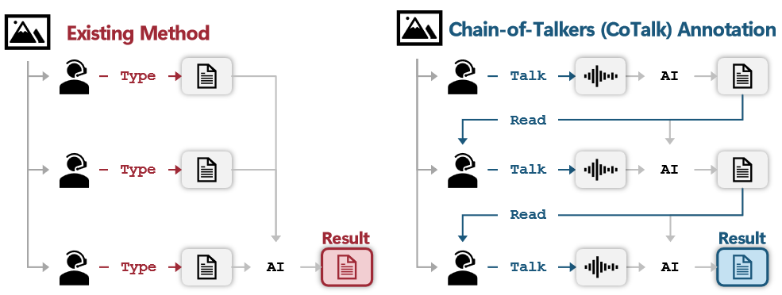

<div align="center">

# [Chain-of-Talkers (CoTalk): Fast Human Annotation of Dense Image Captions](https://arxiv.org/abs/2505.22627)


[Yijun Shen (沈逸骏)*](https://multimodality.group/author/%E6%B2%88%E9%80%B8%E9%AA%8F/) 
, &nbsp; &nbsp; 
[Delong Chen (陈德龙)*](https://chendelong.world/) 
, &nbsp; &nbsp;
[Fan Liu (刘凡)*](https://multimodality.group/author/%E5%88%98%E5%87%A1/) ✉
, &nbsp; &nbsp;
[Xingyu Wang (王兴宇)](https://multimodality.group/author/%E7%8E%8B%E5%85%B4%E5%AE%87/) 
, &nbsp; &nbsp;

[Chuanyi Zhang (张传一)](https://ai.hhu.edu.cn/2023/0809/c17670a264073/page.htm) 
, &nbsp; &nbsp;
[Liang Yao (姚亮)](https://multimodality.group/author/%E5%A7%9A%E4%BA%AE/) 
, &nbsp; &nbsp;
[Yuhui Zheng (郑钰辉)](https://faculty.nuist.edu.cn/zhengyuhui/en/index.htm) 


\*  *Equal Contribution*    ✉ *Corresponding Author*
</div>

---

## 📰 News
- **2025/8/20**: 🎉 Our paper has been accepted to the **Conference on Empirical Methods in Natural Language Processing (EMNLP) 2025**!
  
- **2025/5/28**: Welcome to CoTalk! The preprint is available and the code is now open-source.

---

## 🖼️ Introduction
Welcome to the official repository of our paper "Chain-of-Talkers (CoTalk): Fast Human Annotation of Dense Image Captions"!



While dense image captions are crucial for training robust vision-language models, the process of collecting them efficiently remains an underexplored challenge.

We introduce **Chain-of-Talkers (CoTalk)**, an AI-in-the-loop methodology designed to maximize the quantity and quality of annotations under a fixed time budget. Our framework is based on two key insights:
1.  **Sequential Annotation**: By having annotators work in a sequence, they only need to describe the "residual"—the visual information missed by previous annotations. This significantly reduces redundant work compared to parallel annotation.
2.  **Multimodal Efficiency**: Humans can read text much faster than they can type. By allowing annotators to **speak** their descriptions while reading previous ones, we leverage a much higher throughput for generating new annotations.

Our experiments with eight participants show that **CoTalk improves annotation speed by 40%** (0.42 vs. 0.30 semantic units/sec) and enhances the downstream **retrieval performance** of models trained on its data (41.13% vs. 40.52%) compared to traditional parallel methods.

---

## ⚙️ Installation

The code has been verified to work with PyTorch v2.1.0 and Python 3.9.

1.  **Clone the Repository**
    ```shell
    git clone https://github.com/YiJunShenS/CoTalk
    cd CoTalk
    ```
  
2.  **Create a Conda Environment**
    ```shell
    # Create a new environment with Python 3.9
    conda create -n CoTalk python=3.9
    conda activate CoTalk
    ```

3.  **Install Dependencies**
    ```shell
    # Install PyTorch (example for CUDA 11.8)
    pip install torch==2.1.0+cu118 torchvision==0.16.0+cu118 --extra-index-url https://download.pytorch.org/whl/cu118

    # Install the specific version of OpenAI's Whisper used in our work
    pip install -U openai-whisper==20240930

    # Install remaining packages
    pip install -r requirements.txt
    ```

---

## 🚀 Quick Start

### 1. Data Preparation
Our experiments use the [DOTA-v1.0](https://captain-whu.github.io/DOTA/index.html). Download the images and place them in the following directory:`eval/data/image`

### 2. LLM Configuration
Edit the configuration file with your LLM provider's details (e.g., API key):
```shell
./eval/config/llm/openai.json
```

### 3. Start Annotation
First, navigate to the evaluation directory:
```shell
cd eval
``` 

**Step 1: Initialize Annotation Files**
This script creates the necessary JSON files for each image you wish to annotate.
```shell
# Ensure the --image_folder and --save_json_folder paths are correct
python -m init_annotation_json \
  --image_folder "data/image" \
  --save_json_folder "output/annotation_json"
``` 

**Step 2: Launch the CoTalk Interface**
Start the main annotation application. Adjust the arguments like --person_num as needed.
```shell
# This example starts a 2-person annotation chain
python -m cotalk \
  --json_folder_path "output/annotation_json" \
  --audio_save_dir "output/audio" \
  --original_image_folder "data/image" \
  --person_num 2
``` 

**Step 3: Extract Semantic Units**
After annotating, run this script to parse the final captions into structured semantic units for evaluation. 
```shell
python -m get_semantic_units \
  --annotation_json_folder "output/annotation_json" \
  --save_folder "output/semantic_units_json"
``` 

---

## 🙏 Acknowledge
- Thanks Yanyan Li (李岩岩), Zhelin Zhu (朱喆麟), Xiangyu Gao (高翔宇) and Shuhua Cao (曹书华) for their efforts on the annotation.

---

## 📫 Contact
For questions or inquiries, please feel free to reach out to 2106040215@hhu.edu.cn.

---

## 📜 Citation
If you find our work useful for your research, please consider citing our paper:
```bibtex
@article{shen2025chain,
  title={Chain-of-Talkers (CoTalk): Fast Human Annotation of Dense Image Captions},
  author={Shen, Yijun and Chen, Delong and Liu, Fan and Wang, Xingyu and Zhang, Chuanyi and Yao, Liang and Zheng, Yuhui},
  journal={arXiv preprint arXiv:2505.22627},
  year={2025}
}
```
